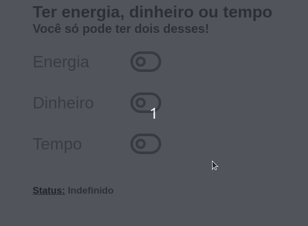

# Energia, Dinheiro ou Tempo
## Você só pode ter dois desses ao mesmo tempo!

  
  

  <a href="#tecnologias">Tecnologias</a>&nbsp;&nbsp;&nbsp;|&nbsp;&nbsp;&nbsp;
  <a href="#projeto">Projeto</a>&nbsp;&nbsp;&nbsp;|&nbsp;&nbsp;&nbsp;
  <a href="#instalação-e-execução">Instalação e execução</a>&nbsp;&nbsp;&nbsp;|&nbsp;&nbsp;&nbsp;
  <a href="#licença">Licença</a>

  

## Tecnologias

- ReactJS — A JavaScript library for building user interfaces

## Projeto

Um projeto criado somente para estudo do ReactJS e dos seus hooks. Que mostra que você não pode ter tudo ao mesmo tempo na vida.

## Pré-requisitos

- [Node.js](https://nodejs.org/en/)

## Instalação e execução

1. Faça um clone desse repositório;
2. Entre na pasta `cd energia-dinheiro-tempo`;
3. Rode `npm install` para instalar as dependências;
4. Rode `npm start` para iniciar a aplicação;
5. Entre no `http://localhost:3000` no seu navegador;

## Licença

Esse projeto está sob a licença MIT. Veja o arquivo [LICENSE](LICENSE.md) para mais detalhes.
